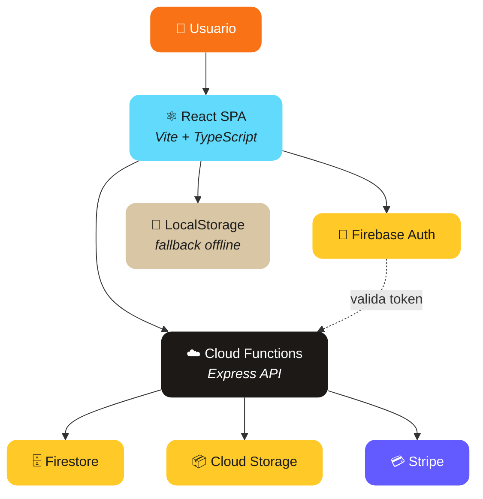

<div align="center">

# Painel Admin

**Painel administrativo completo para gestao pessoal — financas, tarefas, calendario, notas e muito mais.**

[](https://typescriptlang.org)
[](https://react.dev)
[](https://vite.dev)
[](https://firebase.google.com)
[](https://stripe.com)
[](#license)

[Features](#features) · [Arquitetura](#arquitetura) · [Tech Stack](#tech-stack) · [Desenvolvimento](#desenvolvimento) · [Video Promo](#video-promocional)

</div>

---

## O que e o Painel Admin?

Painel Admin e uma aplicacao web modular para **gestao pessoal completa**. Reune financas, tarefas com gamificacao, calendario, notas, CRM de contatos, controle de ponto, automacoes e assistente com IA — tudo em um unico painel com identidade visual premium.

A aplicacao utiliza **Firebase** para autenticacao e persistencia, **Cloud Functions** como camada de API com validacao de assinatura, e **Stripe** para pagamentos recorrentes.

---

## Features

| Modulo | O que voce ganha |
|---|---|
| **Financas** | Gastos, receitas, investimentos, cartoes parcelados, planner financeiro, simulador de investimentos, assistente IA |
| **Tarefas** | CRUD completo, Pomodoro com timer personalizavel, gamificacao (XP, niveis, streak diario), metricas e graficos |
| **Calendario** | Eventos com lembretes, visualizacao mensal, integracao com tarefas |
| **Notas** | Anotacoes rapidas com pins, ordenacao e dashboard visual |
| **Relacionamentos** | CRM pessoal com contatos, interacoes, estagios e prioridades |
| **Timeclock** | Registro de ponto, validacao de jornada no backend, exportacao PDF |
| **Automacoes** | Regras automaticas com simulacao e toggle manual |
| **Assistente IA** | Consultoria financeira inteligente baseada nos seus dados |
| **Assinatura** | Checkout Stripe, renovacao, controle de status no backend |
| **Dashboard** | Painel central com atalhos modulares e perfil da conta |

---

## Arquitetura



### Fluxo de dados

1. **Usuario autenticado** → Frontend envia requests para Cloud Functions com `Authorization: Bearer <idToken>`
2. **API valida** assinatura ativa antes de processar qualquer operacao
3. **Assinatura suspensa** → API retorna `403`, frontend opera em modo local (localStorage)
4. **Visitante** → fluxo 100% local, sem chamadas de API

---

## Tech Stack

| Camada | Tecnologia |
|---|---|
| **Framework** | React 18 + TypeScript 5.3 |
| **Build** | Vite 7 |
| **Styling** | CSS Modules + paleta premium customizada |
| **Auth** | Firebase Authentication |
| **Database** | Cloud Firestore |
| **Storage** | Firebase Cloud Storage |
| **API** | Cloud Functions (Express) |
| **Payments** | Stripe Checkout + Subscriptions |
| **Charts** | Recharts |
| **Forms** | React Hook Form + Zod |
| **Icons** | Lucide React |
| **Toasts** | react-hot-toast |
| **PDF** | jsPDF |
| **Video** | Remotion (promo video) |
| **Deploy** | Firebase Hosting |

---

## Desenvolvimento

### Pre-requisitos

- Node.js 20+
- npm
- Firebase CLI (`npm install -g firebase-tools`)

### Setup

```bash
# Clone
git clone https://github.com/JohnPitter/painel-administrativo.git
cd painel-administrativo

# Instale dependencias
npm install

# Configure variaveis de ambiente
cp .env.example .env
# Preencha as variaveis no .env

# Dev server (frontend)
npm run dev

# Dev server (frontend + Stripe backend)
npm run dev:full

# Build
npm run build
```

### Variaveis de ambiente

Copie `.env.example` para `.env` e preencha:

| Variavel | Descricao |
|---|---|
| `VITE_FIREBASE_API_KEY` | API key do Firebase |
| `VITE_FIREBASE_AUTH_DOMAIN` | Auth domain do projeto |
| `VITE_FIREBASE_PROJECT_ID` | ID do projeto Firebase |
| `VITE_FIREBASE_STORAGE_BUCKET` | Bucket do Cloud Storage |
| `VITE_FIREBASE_MESSAGING_SENDER_ID` | Sender ID do FCM |
| `VITE_FIREBASE_APP_ID` | App ID do Firebase |
| `VITE_FIREBASE_MEASUREMENT_ID` | ID do Google Analytics |
| `STRIPE_SECRET_KEY` | Chave secreta do Stripe |
| `STRIPE_PRICE_ID` | ID do preco/plano Stripe |

### Estrutura

```
src/
  core/                    # Config global, layouts, rotas e providers
    config/firebase.ts     # Inicializacao do Firebase
    layout/                # AuthLayout, DashboardLayout
    providers/             # FirebaseProvider
    routes/                # AppRouter, ProtectedRoute
  modules/
    auth/                  # Login, contextos de auth e conta
    dashboard/             # Painel principal, perfil
    finance/               # Gastos, receitas, investimentos, planner, charts
    tasks/                 # Tarefas, Pomodoro, gamificacao
    calendar/              # Eventos e lembretes
    notes/                 # Anotacoes e dashboard
    relationships/         # CRM pessoal de contatos
    timeclock/             # Registro de ponto
    automations/           # Regras automaticas
    assistant/             # Assistente IA financeiro
    landing/               # Home, marketing, assinatura
  shared/                  # Componentes e utilitarios reutilizaveis
server/                    # Backend Stripe (Express)
functions/                 # Cloud Functions (Firebase)
firebase/                  # Regras Firestore, Storage, CORS
video/                     # Video promocional (Remotion)
docs/                      # Documentacao interna
```

---

## Video Promocional

O projeto inclui um video promocional de 21 segundos feito com [Remotion](https://remotion.dev) — animacoes cinematograficas renderizadas via React.

```bash
# Preview no navegador (Remotion Studio)
npm run video:preview

# Renderizar MP4
npm run video:render
```

O video contém 5 cenas com transicoes crossfade:

1. **Hero Reveal** — abertura cinematografica com mockup do dashboard
2. **Detail Showcase** — grid dos 8 modulos com parallax
3. **Lifestyle** — app em uso (mobile + desktop side-by-side)
4. **Brand Statement** — logo com ring de features
5. **CTA** — call-to-action com botao animado

---

## Deploy

```bash
# Deploy completo (hosting + functions + regras)
firebase deploy

# Apenas hosting
firebase deploy --only hosting

# Apenas functions
firebase deploy --only functions

# Apenas regras Firestore
firebase deploy --only firestore:rules
```

---

## License

MIT License — use livremente.
